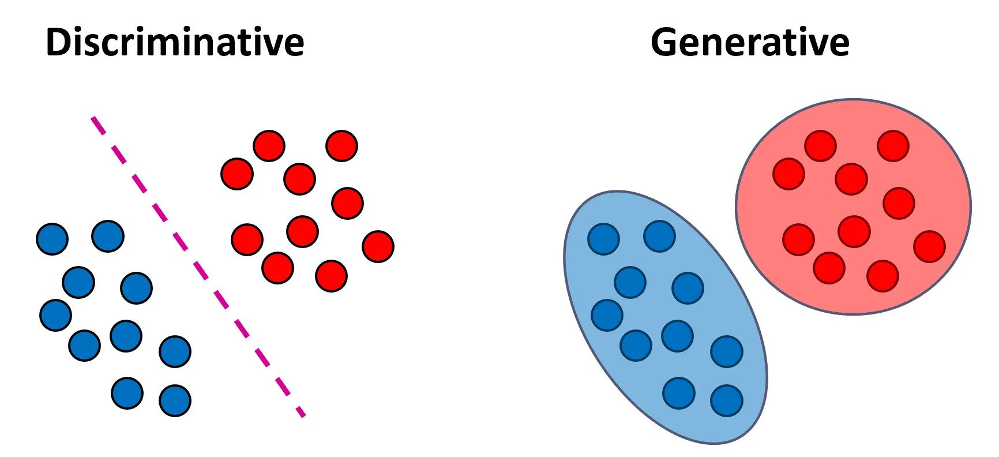
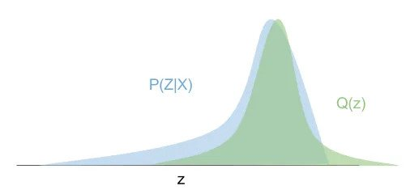

# VAE - Variational AutoEncoder

The paper [Auto-Encoding Variational Bayes](https://arxiv.org/pdf/1312.6114.pdf) combines variational inference with autoencoders, 
forming a family of generative models that learn the intractable posterior distribution of a 
continuous latent variable for each sample in the dataset. 
This repository provides an implementation of such an algorithm, along with a comprehensive explanation.

Prerequisites (explained in the introduction sections):
- **Auto-encoders**: This concept is crucial because VAEs are a specific type of auto-encoder. 
  Understanding the architecture and purpose of auto-encoders, such as dimensionality reduction, 
  and their relation to Principal Component Analysis (PCA), is fundamental.
- **Generative Models**: VAEs are generative models, which are able to generate new data samples that resemble the training data. 
  Understanding what generative models are and how they work is important to understanding VAEs.
- **Variational Inference**: This is the statistical technique used in VAEs to perform the inference of the latent variables and to train the model. 
  Understanding this technique is necessary to understand the training process and the capabilities of VAEs.

## Dimensionality reduction

[Dimensionality reduction](https://en.wikipedia.org/wiki/Dimensionality_reduction) is a technique used to reduce the computational complexity 
and enhance the interpretability of high-dimensional datasets (e.g. visualization). 

The forthcoming sections will delve into two widely-used dimensionality reduction techniques: Principal Component Analysis (PCA) and Autoencoders. 
For an in-depth understanding of these algorithms, readers are encouraged to refer to their respective Wikipedia pages, 
which offer comprehensive explanations (relevant links will be provided in the text).

### PCA - Principal Component Analysis

[PCA](https://en.wikipedia.org/wiki/Principal_component_analysis) is a `linear transformation` that captures the highest variance in data. 
It transforms the input data by projecting it onto a set of orthogonal axes, derived from the data, called principal components.

When a linear transformation is adequate for dimensionality reduction, PCA often serves as the preferred method. 
However, for scenarios demanding more robust techniques, we may resort to sophisticated methods such as autoencoders.

[StatQuest](https://www.youtube.com/@statquest) PCA video explanation can be found [here](https://www.youtube.com/watch?v=FgakZw6K1QQ).

### AutoEncoder

[Autoencoder](https://en.wikipedia.org/wiki/Autoencoder) are artificial neural networks that learn efficient data representations 
by encoding the input data into a lower-dimensional code 
and then decoding it to reconstruct the original input. Unlike PCA, autoencoders are not restricted to linear transformations.

#### Architecture, training and application

In summary:
- The `encoder` generates a compressed representation of the input. 
- The `decoder` reconstructs the original input from this compressed representation.

Image reference: [Keras - Autoencoder](https://blog.keras.io/building-autoencoders-in-keras.html)

During the training phase, the objective is to optimize the reconstruction loss (for instance, by minimizing the Mean Squared Error (MSE) of the reconstructed input).

Potential applications include:
- Compressing the input data to a 2D or 3D form for simplified visualization.
- Image denoising, such as eliminating blur from an image.

### Generative models Connection with VAE

Generative models are a class of unsupervised learning algorithms that create new data instances resembling your training data. 
In contrast to discriminative probabilistic models, which model `p(y|x)` (the distribution of the output given the input), 
generative models model `p(x, y)` (the joint distribution). This distinction enables generative models to synthesize novel data points. 
Applications of generative models span various domains, including image synthesis, text generation, and more.

For classification tasks, discriminative models focus on learning the boundaries separating the classes, 
whereas generative models are concerned with understanding the distinct distributions of input data for each class. Refer to the image above.

Image reference: [Medium - Generative vs. Discriminative Models](https://medium.com/@roiyeho/generative-vs-discriminative-models-35b81f677822)

An example of a generative model is the Variational Autoencoder (VAE), while the vanilla autoencoder serves as an example of a discriminative model.

#### VAE as an extension of the autoencoder

An autoencoder is a non-probabilistic, discriminative model, meaning it models `y = f(x)` and does not model the probability. 
By applying variational inference and the autoencoder architecture, we can construct a generative model. 
This generative model allows us to sample new data from the learned distribution once the model has been trained. 
It also permits us to sample from the learned posterior conditioned on the input, which enables generating images similar to the input image.

Moreover, VAEs provide several additional benefits. They compel similar samples to cluster closely in the latent space 
and ensure that all samples are near the predefined VAE prior. This implicitly adds a regularization constraint on the encoder 
and also enables interpolation. Consequently, minor changes in the compressed representation lead to slight variations in the newly generated sample.

## Variational Inference

In order to explain the Bayesian `variational inference` method, we need to first refer to Bayesian approach and the intractability problem.

### Bayesian Inference

[Bayesian inference](https://en.wikipedia.org/wiki/Bayesian_inference) is a method of statistical inference in which Bayes' 
theorem is used to update the probability for a hypothesis as more evidence or information becomes available. 

In my perspective, the most intuitive way to comprehend Bayesian inference is by juxtaposing it with the frequentist approach.

When training a model (for instance, a classifier) on available data to perform inference, 
one straightforward approach is to estimate the model parameters using maximum likelihood estimation (MLE) - 
$L(\theta, X)$ = $\prod_{i} p(X_i;\theta)$, where $\theta$ represents the set of parameters we aim to estimate, 
$X$ represents the data, and $p(X_i;\theta)$ is the probability (mass or density function) of the sample $X_i$ given a fixed parameter set $\theta$.
Note that we are not making any assumptions about parameter set $\theta$.

Again, [StatQuest](https://www.youtube.com/@statquest) video explanation for the maximum likelihood can be found 
[here](https://www.youtube.com/watch?v=9wCnvr7Xw4E).

In cases where we possess prior knowledge about the parameter set $\theta$, we can utilize the Bayesian method rooted in 
[Bayes' theorem](https://en.wikipedia.org/wiki/Bayes%27_theorem) $p(\theta|x) = \frac{p(x|\theta)\cdot p(\theta)}{p(x)}$, where $x$ represents the observed data.
In this formula, $p(\theta)$ is our prior knowledge, $p(x|\theta)$ is the likelihood (how we would obtain $x$ given $\theta$), 
and $p(x)$ is the marginal likelihood or evidence, acting as a normalization factor.
Here's the key idea: Prior to observing any data, we have only our prior knowledge about the parameter set $\theta$ - $p(\theta)$. 
Once we observe some data, we can apply Bayes' theorem to compute the posterior - 
$p(\theta|x)$, which is our updated belief about the parameters $\theta$ given the observed data $x$.

Keep in mind (this is crucial): If we establish the prior $p(\theta)$ and the likelihood $p(x|\theta)$, 
then we inherently define the joint distribution $p(x, \theta)$ as well. This is because $p(x, \theta) = p(x|\theta)\cdot p(\theta)$ by definition.

### Latent variable

In terms of Bayes' theorem, a latent variable signifies an unseen, fundamental feature that we strive to discern from the data at hand. Specifically in image processing, 
a latent variable could embody a non-visible attribute of an image, such as its inherent style or content. 
Ideally, we could recreate these images utilizing their corresponding latent representations.

### ELBO derivation

Assume that we are working with images $x$ (observed) with latent variable $z$ (unobserved). 
With assumption that we have **prior** $p(z)$, **likelihood** $p(x|z)$ and thus also joint distribution $p(x, z)$, we want to 
infer the **posterior** $p(z|x)$:

$p(z|x) = \frac{p(x|z)\cdot p(z)}{p(x)}$

We lack the marginal $p(x)$, but it could be calculated from the joint distribution $p(x, z)$:

$p(x) = \int_z p(x, z) dz$.

Please note, this is an informal notation assuming that $z$ is multidimensional. In such a case, multiple integrals would be needed for each dimension. 
In general, we don't have a [closed](https://en.wikipedia.org/wiki/Closed-form_expression) and it's usually unrealistic to compute 
it due to [intractability](https://en.wikipedia.org/wiki/Computational_complexity_theory#Intractability).

The concept behind variational inference is to recast the problem as an optimization of a surrogate distribution $q(z)$, 
which is similar to the true posterior distribution $p(z|x)$, and comes from a simple family (e.g., Gaussian) 
that is easy and effective to work with.

We can use [Kullback–Leibler divergence](https://en.wikipedia.org/wiki/Kullback–Leibler_divergence) 
to measure the similarity between the distributions $q(z)$ and the $p(z|x)$. The KL divergence is defined as:

$KL(p||q) = E_{x\sim p(x)}\[log(\frac{p(x)}{q(x)})\] = \sum_x p(x)\cdot log(\frac{p(x)}{q(x)})$

Although this isn't a distance since it isn't symmetric, it is always non-negative and equals 0 when the distributions match. 
Formally, we want to solve the optimization problem:

$q_{*} = argmin_{q} KL(q(z), p(z|x))$

This cannot be directly applied since we don't have the posterior $p(z|x)$, but we can rearrange:

- $KL(q(z)||p(z|x)) = E_{z\sim q(z)}\[log(\frac{q(z)}{p(z|x)})\]$
- $=E_{z\sim q(z)}\[log(\frac{q(z)\cdot p(x)}{p(x,z)})\]$ (conditional probability)
- $=E_{z\sim q(z)}\[log(\frac{q(z)}{p(x,z)})\]+E_{z\sim q(z)}\[log(p(x))\]$
- $=E_{z\sim q(z)}\[log(\frac{q(z)}{p(x,z)})\]+log(p(x))$
- $=-E_{z\sim q(z)}\[log(\frac{p(x,z)}{q(z)})\]+log(p(x))$

The $log(p(x))$ is called the evidence in this case (the "real" evidence by terminology should be $p(x)$ ). We can show that
$E_{z\sim q(z)}\[log(\frac{p(x,z)}{q(z)})\]$ is the `Evidence Lower BOund (ELBO)` i.e. $log(p(x)) \geq E_{z\sim q(z)}\[log(\frac{p(x,z)}{q(z)})\]$

- We know: $0 \leq p(x) \leq 1 \Rightarrow log(p(x)) \leq 0$ and
- $KL(q(z)||p(z|x)) \geq 0$
- Hence $- E_{z\sim q(z)}\[log(\frac{p(x,z)}{q(z)})\] + log(p(x)) \geq 0$
- Finally: $log(p(x)) \geq E_{z\sim q(z)}\[log(\frac{p(x,z)}{q(z)})\]$.

But why is the `ELBO` important to use? We know that $q(z)$ perfectly fits $p(z|x)$ iff $KL(q(z)||p(z|x)) = 0$. This is equivalent to
$log(p(x)) = E_{z\sim q(z)}\[log(\frac{p(x,z)}{q(z)})\]$. We also know that increasing the `ELBO` decreases $KL(q(z)||p(z|x))$. Hence,
minimizing the $KL(q(z)||p(z|x))$ is equivalent to the maximization of the `ELBO` with the optimal value being (if reachable)
when the ELBO reaches the evidence.

In the next section, we'll examine how we can combine variational inference with autoencoder architecture.

## VAE

In this case we want to define the prior $p(z)$ and the likelihood $p(x|z)$ through neural networks. This way we indirectly
define our joint distribution as $p(x,z) = p(x|z)\cdot p(z)$. We can train our network by maximizing the `ELBO`.

[Gaussian distribution](https://en.wikipedia.org/wiki/Normal_distribution) is a continuous probability distribution from 
[exponential family](https://en.wikipedia.org/wiki/Exponential_family) that is often used because it is easy to work with. One of the main 
benefits of this distribution is that is a
[conjugate prior](https://en.wikipedia.org/wiki/Conjugate_prior) (posterior has the same probability distribution as the prior).

Let's assume that $p(z) \sim  N(0, 1)$ and $p(x|z) \sim  N(f_d(z), c\cdot I)$ where $f_d(z)$ the decoder neural network. We model our surrogate
posterior $q(z) \sim  p(z|x)$ using the encoder neural network where $q(z) \sim  N(f_e(z), g_e(z)$.

### Re-parametrization trick

When maximizing the `ELBO` we have to estimate the expectation: $E_{z\sim q(z)}\[log(\frac{p(x,z)}{q(z)})\]$.
Easiest way to do that is to use [Monte Carlo method](https://en.wikipedia.org/wiki/Monte_Carlo_method) for estimate of the expectation
as the mean of sample $z_i$ from $q(z)$ distribution:

$\sum_j log(\frac{p(x,z_j)}{q(z_j)})$

The problem here is that we can't back-propagate this way through the sampled values. Instead we can use the 
[reparametrization trick](https://stats.stackexchange.com/questions/199605/how-does-the-reparameterization-trick-for-vaes-work-and-why-is-it-important)
where we sample from $\epsilon \sim  N(0, 1)$ and use simple linear transformation $z = f_e(x) + g_e(x)\cdot \epsilon$ to obtain sample
from $N(f_e(z), g_e(z)$. This way we back-propagate through encoder but of course not through the $\epsilon$.

### Loss function

Finally, we can derive the VAE loss function and the training algorithm using Gaussians under the following assumptions:
- Prior distribution $p(z)$ is a standard Normal distribution: $p(z) \sim  N(0, I)$
- Posterior distribution $q(z)$ (or $q(z|x)$ ) is a Gaussian distribution parameterized by an encoder: $q(z|x) \sim  N(f_e(x_i), g_e(x_i))$, 
  where $f_e(x_i)$ and $g_e(x_i)$ are the mean and variance respectively.
- $p(x|z) \sim  N(f_d(z), c\cdot I)$ where $c$ is uncertainty hyperparameter. 

Our loss for a single sample $x_i$ now becomes:
- $L_{f_e,g_e,f_d}(x_i) = \sum_j log(\frac{p(x_i,z_j)}{q(z_j)})$
- $= \sum_j log(\frac{p(x_i|z_j)\cdot p(z_j)}{q(z_j)})$
- $= \sum_j log(p(x_i|z_j)) + log(\frac{p(z_j)}{q(z_j)})$

Replacing $log(p(x_i|z_j))$ with its probability density function, we get:
- $log(p(x_i|z_j)) = log((\frac{1}{2\cdot \pi})^{\frac{d}{2}})\cdot |c\cdot I|^{-\frac{1}{2}}\cdot exp(-\frac{||x_i - f_d(z_j)||^{2}_{2}}{2\cdot c})$
- We can ignore everything except the part in the exponent since it is constant addition in the optimization problem.
- $\sim -\frac{1}{2\cdot c}\cdot ||x_i - f_d(z_j)||^{2}_{2}$

For the term $\sum_j log(\frac{p(z_j)}{q(z_j)})$ we have (which is estimation of the KL divergence between $p(z_j)$ and $q(z_j)$ ):
- $\sum_j log(\frac{p(z_j)}{q(z_j)})$
- $=-\sum_j log(\frac{q(z_j)}{p(z_j)})$
- $=-KL(q(z)||p(z))$
- $=\sum_k \frac{1}{2} \cdot (1 + log(g_{e,k}(x_i)) - (g_{e,k}(x_i))^2 - {f_{e,k}(x_i)}^2)$ ([reference](https://stats.stackexchange.com/questions/7440/kl-divergence-between-two-univariate-gaussians))
  - Note: We sum over all independent random variables $z_{j,k}$ over random vector $z_j$.

At the end we have:
- $\sum_k \frac{1}{2} \cdot (1 + log(g_{e,k}(x_i)) - (g_{e,k}(x_i))^2 - {f_{e,k}(x_i)}^2) - \sum_j \frac{1}{2\cdot c}\cdot ||x_i - f_d(z_j)||^{2}_{2}$
- We want to maximize this term. We can also minimize the negative value.
- When using minibatch stochastic gradient descent, we can average the loss over all $x_i$ data samples.
- Also, when using minibatches, it is common to draw a single sample from the $q(z)$ distribution for each element in the minibatch.

Finally, the algorithm is:
- Use the encoder to get the parameters of the posterior $q(z)$. Note that $q(z) \sim q(z|x)$ is actually conditioned on the input.
- Draw one or more samples from $q(z)$ distribution for each element in the minibatch (using the re-parameterization trick).
- Run the decoder to reconstruct the input - $p(x|z)$.
- Calculate the loss and backpropagate the gradients to update the parameters.

Remember, the ELBO is composed of two terms: the reconstruction term (which encourages the decoder to reconstruct the input well) 
and the regularization term (which encourages the posterior distribution to be close to the prior distribution). 
The balance between these two terms controls the trade-off between data fidelity and distribution matching, a common theme in variational inference.

## References

[Auto-Encoding Variational Bayes](https://arxiv.org/abs/1312.6114)

[Variational Inference](https://www.youtube.com/watch?v=HxQ94L8n0vU&list=PLISXH-iEM4JloWnKysIEPPysGVg4v3PaP)
